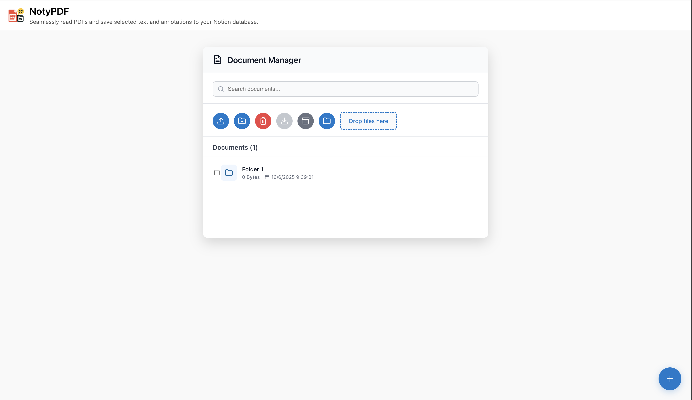
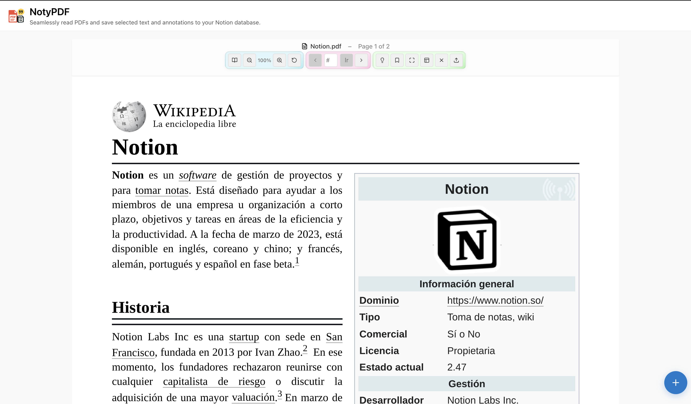
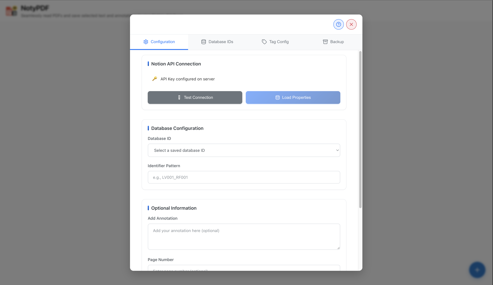
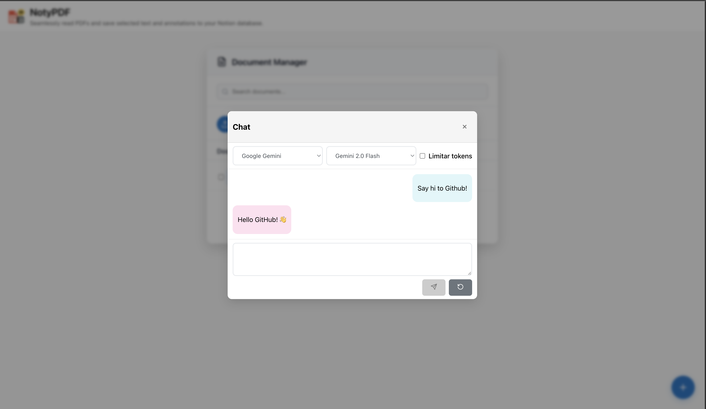
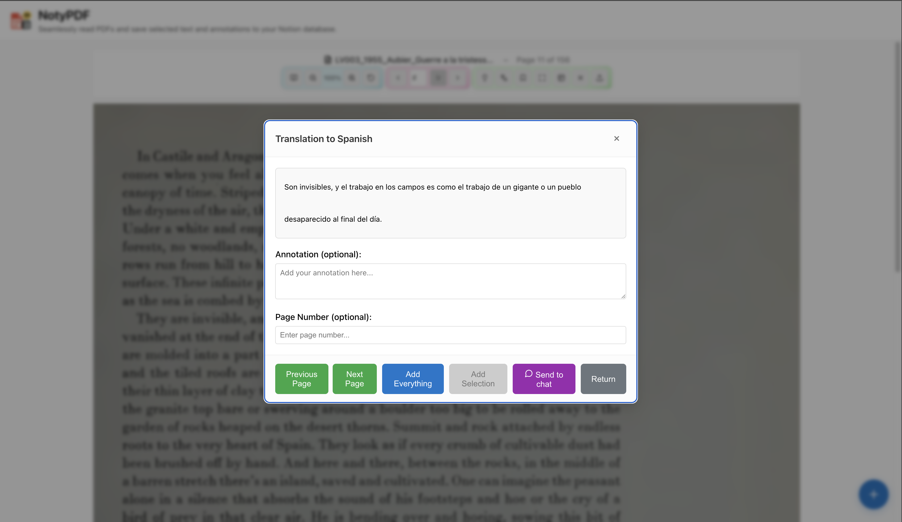

<!-- Centered logo -->
<p align="center">
  
</p>

<h1 align="center">NotyPDF</h1>

<p align="center"><b>Extract, organize and save PDF highlights directly to Notion with automatic reference management.</b></p>

---

## Table of Contents
- [Description](#description)
- [Feature Highlights](#feature-highlights)
- [How It Works](#how-it-works)
- [Screenshots](#screenshots)
- [Getting Started](#getting-started)
- [Advanced Features](#advanced-features)
- [Progressive Web App](#progressive-web-app)
- [Web Capture Extension](#web-capture-extension)
- [License](#license)

## Description
NotyPDF is a web-based helper for researchers and students. Upload your documents, select important text and store it in your Notion workspace with custom tags and reference IDs. A built-in document manager keeps everything organized while backups ensure your configuration is safe.

## Feature Highlights
- **PDF Upload**: Drag & drop or browse PDFs for fast viewing.
- **Document Manager**: Maintain your document library with search, download and delete options.
- **Text Selection**: Highlight any text within a PDF and send it to Notion.
- **Notion Integration**: Save excerpts, annotations and page numbers directly to your database.
- **Custom Identifiers**: Generate sequential reference IDs like `LV001_RF025`.
- **Automatic Increment**: Existing IDs are incremented automatically.
- **Tag Configuration**: Build your own tagging system without using Notion AI.
- **Document Tagging**: Optionally add the document ID as a tag in Notion.
- **Annotation Support**: Add your personal notes to each reference.
- **Configuration Menu**: A tabbed interface to manage all settings.
- **Backup & Restore**: Export or import the complete configuration at any time.
- **Translation Support**: Optional AI‑powered translation services.

## How It Works
1. **Load your PDF document** via the upload dialog or the document manager.
2. **Configure Notion** credentials and columns in the settings panel.
3. **Select text** from the document.
4. **Add an annotation or page number** if desired.
5. **Save** the entry to your chosen Notion database.

## Screenshots
Below are some example screens from the application interface.

<p align="center">
  
</p>

<p align="center">
  
</p>

<p align="center">
  
</p>

<p align="center">
  
</p>

<p align="center">
  
</p>

## Getting Started
Follow these steps to get NotyPDF running on your machine.

### Quick Start Guide
1. **Upload Documents** using the document manager.
2. **Configure Notion** in the settings menu.
3. **Create Tags** in the Tag Config tab.
4. **Start Extracting** and save your notes to Notion.
5. **Backup Settings** from the Backup tab.

### 1. Download from GitHub
If you're unfamiliar with GitHub:
1. Visit the [NotyPDF repository](https://github.com/drakonis96/notypdf).
2. Click **Code** → **Download ZIP**.
3. Unzip the archive to a folder such as your Desktop.

### 2. Set Up Environment Variables
1. Open the extracted folder.
2. Copy `.env.example` to `.env`.
3. Edit `.env` in a text editor and add your API keys:
   ```env
   NOTION_API_KEY=secret_your_notion_api_key_here
   OPENAI_API_KEY=your_openai_key_here
   OPENROUTER_API_KEY=your_openrouter_key_here
   GEMINI_API_KEY=your_gemini_key_here
   DEEPSEEK_API_KEY=your_deepseek_key_here
   ```

### 3. Run with Docker Compose (Recommended for Beginners)
1. [Install Docker Desktop](https://www.docker.com/products/docker-desktop/) for your OS.
2. Start Docker Desktop.
3. Open a terminal and `cd` to the NotyPDF folder, for example:
   ```sh
   cd Desktop/notypdf
   ```
4. Build and start the app:
   ```sh
   docker-compose up --build
   ```
5. The first run creates `data` and `myworkspace` folders beside `docker-compose.yml`. Your configuration lives inside `data` so it persists when updating the container.
6. Wait for the server to start, then open [http://localhost:5026](http://localhost:5026).

If you prefer `docker run`, mount the same folders:
```sh
docker run -d \
  -p 5026:5026 \
  -v $(pwd)/data:/app/data \
  -v $(pwd)/myworkspace:/myworkspace \
  --name notypdf drakonis96/notypdf:latest
```

### 4. Alternative: Run the React Server Directly (For Developers)
If you already have Node.js and npm installed:
1. Open a terminal in the NotyPDF folder.
2. Install dependencies:
   ```sh
   npm install
   ```
3. Start the development server:
   ```sh
   npm start
   ```
4. Visit [http://localhost:3000](http://localhost:3000) in your browser.

## Advanced Features

### Document Manager
A centralized place for all your research materials:
- **Multi-format Support**: Upload PDFs, Word documents, text files and images.
- **Search**: Quickly find any document.
- **File Management**: Rename or delete items and perform batch operations.
- **Cloud Storage**: Access your library across sessions.

### Configuration Management
Control your setup from the settings panel:
- **Tabbed Interface** for easy navigation.
- **Real-time Validation** on changes.
- **Multiple Database Support** to switch between workspaces.
- **Export/Import** to back up or restore the entire configuration.

### Custom Tagging System
- **Manual Tag Creation** to match your workflow.
- **Template System** for reusable patterns.
- **Hierarchical Organization** for complex tagging schemes.
- **No AI Dependency**: You remain in full control.

### Backup & Recovery
- **Complete Configuration Export** as a single JSON file.
- **Instant Restoration** from a saved backup.
- **Version Control** through multiple backup files.
- **Migration Support** for moving between installations.

### Tag Configuration Tutorial
1. Open the settings menu and go to **Tag Config**.
2. Create custom tag categories and templates.
3. Apply tags manually to selected text.
4. Manage your tag library by editing or removing entries.
5. Enjoy consistent and reliable tagging with no AI required.

### Backup & Restore Tutorial
1. Navigate to the **Backup** tab in settings.
2. Click **Download Backup** and save the JSON file.
3. To restore, select **Upload Backup** and choose your file.
4. All database IDs, column mappings and tag settings will be restored.

### Tips & Tricks
- Keep a clean library by organizing documents in the manager.
- Use consistent IDs like `LV001` for easy filtering.
- Number references sequentially (`RF001`, `RF002`) or by page.
- Regularly back up your configuration before major changes.
- Configure translation services for multilingual research.

## Progressive Web App
NotyPDF can be installed as a PWA in supported browsers. Open the app and use the **Install** option from your browser’s menu to launch it like a native application, even when offline.

## Web Capture Extension
Capture text from any website and send it to Notion using your NotyPDF configuration.
1. Open `chrome://extensions` and enable **Developer mode**.
2. Click **Load unpacked** and select the `extension` folder.
3. Set the URL where NotyPDF is running (for example `http://localhost:3000`). If you expose the server through NGINX Proxy Manager, enter the external URL and credentials.
4. Select text on a webpage or PDF, click the extension icon and press **Send to Notion**. You can also right-click a selection and choose **Send selection to NotyPDF**.
5. Access extension settings and help directly from the popup.

Using a reverse proxy lets the extension work from any browser, allowing you to add references to Notion even if the server isn’t running locally. The extension fetches your saved configuration and creates a new entry with the next identifier.

---

## License

This project is licensed under the GNU General Public License v3.0. See the [LICENSE](LICENSE) file for details.

---

<p align="center"><i>Happy reading and organizing with NotyPDF!</i></p>

