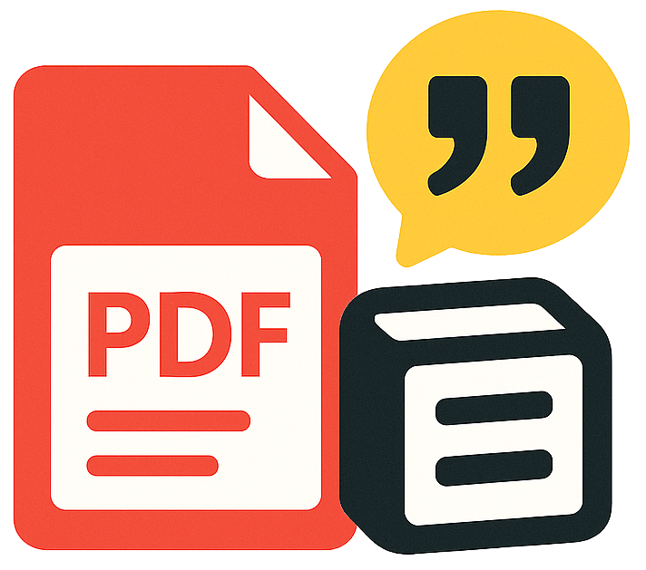

<!-- Centered logo -->
<p align="center">
  
</p>

<h1 align="center">NotyPDF</h1>

<p align="center">
  <b>Extract, organize, and save PDF highlights dire4. Start the development server:
   ```sh
   npm start
   ```
5. Open [http://localhost:3000](http://localhost:3000) in your browser.

## Advanced Features

### Document Manager
The document manager provides a centralized location for all your research materials:

- **Multi-format Support**: Upload PDFs, Word documents, text files, and images
- **Search Functionality**: Quick search through your document library
- **File Management**: Organize, rename, and delete documents as needed
- **Batch Operations**: Handle multiple files efficiently
- **Cloud Storage**: Documents are stored securely and accessible across sessions

### Configuration Management
The settings panel offers comprehensive control over your NotyPDF experience:

- **Tabbed Interface**: Organized sections for different configuration types
- **Real-time Validation**: Immediate feedback on configuration changes
- **Multiple Database Support**: Manage connections to different Notion workspaces
- **Export/Import Settings**: Backup and restore your complete configuration

### Custom Tagging System
Take full control of your document organization:

- **Manual Tag Creation**: Define tags that match your research methodology
- **Template System**: Create reusable tag patterns for consistency
- **Hierarchical Organization**: Build complex tag structures for detailed categorization
- **No AI Dependency**: Completely manual control without relying on automated systems

### Backup & Recovery
Ensure your configurations are always safe:

- **Complete Configuration Export**: Download all settings as a single JSON file
- **Instant Restoration**: Restore settings with a single file upload
- **Version Control**: Keep multiple backup versions for different project phases
- **Migration Support**: Easily move configurations between installations

--- Notion with automatic reference management.</b>
</p>

---

## Overview
NotyPDF helps you extract and save text from PDF documents to your Notion database, with flexible configuration options for organizing your notes and references.

## Main Features
- **PDF Upload**: Drag & drop or select PDF files for viewing.
- **Document Manager**: Upload, organize, and manage your document library with search, download, and delete capabilities.
- **Text Selection**: Select and highlight text within PDF documents.
- **Notion Integration**: Save selected text, annotations, and page numbers directly to your Notion database.
- **Custom Identifiers**: Generate sequential, customizable reference IDs (e.g., `LV001_RF025`).
- **Automatic Reference Numbering**: If a reference ID already exists, NotyPDF will automatically increment the number for you.
- **Tag Configuration**: Create and manage custom tags without relying on Notion's AI - full manual control over your tagging system.
- **Document Tagging**: Optionally insert a document ID as a tag in a multi-select Notion column for easy filtering.
- **Annotation Support**: Add your own notes or categories to each reference.
- **Configuration Menu**: Comprehensive settings panel with tabbed interface for easy navigation.
- **Backup & Restore**: Export and import your configurations to ensure your settings are never lost.
- **Translation Support**: Optional AI-powered translation with multiple provider support.
- **Easy Configuration**: User-friendly interface for setting up Notion API credentials and database columns.

## How It Works
1. **Load your PDF document** using the file upload or document manager
2. **Configure your Notion database connection and columns** through the settings panel
3. **Select text from the document**
4. **Add optional annotation and page number**
5. **Save to your Notion database**

## New Features Guide

### Document Manager
Access the document manager through the floating action button or menu to:
- **Upload Multiple Documents**: Support for PDF, DOC, DOCX, TXT, and image files
- **Search & Filter**: Quickly find documents in your library
- **Manage Files**: Load, download, or delete documents as needed
- **Batch Operations**: Upload multiple files at once or clear all files
- **File Information**: View file sizes, upload dates, and other metadata

### Configuration Menu
The modern tabbed configuration interface includes:

#### Configuration Tab
- **Database Setup**: Connect to your Notion databases
- **Column Mapping**: Define which columns store your data
- **Translation Settings**: Configure AI translation services
- **Advanced Options**: Customize identifier patterns and behavior

#### Database IDs Tab
- **Saved Databases**: Manage multiple database configurations
- **Quick Switching**: Easily switch between different Notion databases
- **Database Naming**: Add custom names to identify your databases

#### Tag Configuration Tab
- **Manual Tag Control**: Create custom tags without Notion AI assistance
- **Tag Templates**: Set up reusable tag patterns
- **Document Categorization**: Organize content with your own tagging system
- **No AI Dependency**: Full manual control over tag creation and assignment

#### Backup Tab
- **Export Settings**: Download your complete configuration as a JSON backup
- **Restore Configuration**: Upload and restore previous settings
- **Clear All Data**: Reset all configurations when needed
- **Data Protection**: Ensure your settings are never lost

### Tag Configuration Tutorial

The Tag Configuration feature gives you complete control over document tagging without relying on Notion's AI:

1. **Access Tag Configuration**:
   - Open the configuration menu (⚙️ settings button)
   - Navigate to the "Tag Config" tab

2. **Create Custom Tags**:
   - Define your own tag categories (e.g., Research, Literature, References)
   - Set up tag templates for consistent naming
   - Create hierarchical tag structures

3. **Apply Tags Manually**:
   - Select text from your document
   - Choose from your predefined tags
   - Apply multiple tags to organize content effectively

4. **Manage Tag Library**:
   - Edit existing tags
   - Remove unused tags
   - Reorganize tag categories

5. **Benefits of Manual Tagging**:
   - **Consistency**: Maintain uniform tagging across all documents
   - **Control**: No dependency on AI interpretation
   - **Customization**: Create tags that match your specific workflow
   - **Reliability**: Tags work exactly as you define them

### Backup & Restore Tutorial

Protect your configuration and ensure continuity:

1. **Creating a Backup**:
   - Open Settings → Backup tab
   - Click "Download Backup"
   - Save the JSON file to a secure location
   - Backups include database IDs, column mappings, and all settings

2. **Restoring from Backup**:
   - Click "Upload Backup" in the Backup tab
   - Select your backup JSON file
   - Confirm the restoration
   - Refresh the page to see restored settings

3. **What's Included**:
   - Saved database IDs with names and identifiers
   - Column mappings for all databases
   - Document ID insertion settings
   - Tag configurations
   - Translation preferences

4. **Best Practices**:
   - Create backups before major configuration changes
   - Store backups in multiple locations
   - Regular backup schedule for active users
   - Test restore process periodically

### Database Configuration
- **Database ID**: Your Notion database's unique identifier
- **Identifier Column**: Where each entry's unique identifier will be stored
- **Text Column**: Where the selected text will be saved
- **Annotation Column**: For your notes about the extracted text
- **Page Column**: Where page numbers will be stored

### Identifier Pattern
The identifier pattern uses underscores as separators, e.g. `BOOKID_REFID` (like `LV001_RF025`).
- **BOOKID**: Your document's unique code (e.g., LV001)
- **REFID**: The specific reference/note's unique identifier (e.g., RF025)

If you enter an identifier that already exists, NotyPDF will automatically increment the reference number (e.g., `LV001_RF001` → `LV001_RF002`).

### Document Identifier Insertion
- Use a multi-select column in your Notion database for document IDs.
- When enabled, the BOOKID part of your identifier will be added as a tag, making it easy to filter references by document.

### Tips & Tricks
- **Document Organization**: Use the document manager to maintain a clean library of your research materials
- **Standardized Naming**: Use consistent document IDs (e.g., LV001, BK002) for better organization
- **Sequential References**: Number references sequentially (RF001, RF002) or by page (P045-1, P045-2)
- **Custom Annotations**: Use the annotation field for your own notes, categories, or research insights
- **Database Filtering**: Filter your Notion database by document using the multi-select column
- **Reference Sorting**: Sort references by their reference ID for better organization
- **Backup Regularly**: Create configuration backups before making major changes
- **Tag Consistency**: Use the manual tag configuration for consistent categorization
- **Multiple Databases**: Save different database configurations for different projects
- **Translation Workflow**: Set up translation services for multilingual research

---

## Getting Started

### Quick Start Guide
1. **Upload Documents**: Use the document manager to upload your research materials
2. **Configure Notion**: Set up your database connection in the configuration menu
3. **Create Tags**: Define your tagging system in the Tag Config panel
4. **Start Extracting**: Select text and save to Notion with your custom organization system
5. **Backup Settings**: Export your configuration to ensure settings are preserved

### 1. Download from GitHub
If you are new to GitHub or coding, follow these steps:

1. Go to the [NotyPDF GitHub repository](https://github.com/drakonis96/notypdf).
2. Click the green **Code** button, then **Download ZIP**.
3. Extract the ZIP file to a folder on your computer (for example, your Desktop).

### 2. Set Up Environment Variables

1. Open the extracted folder.
2. Find the file named `.env.example` and make a copy of it.
3. Rename the copy to `.env`.
4. Open `.env` with a text editor (like Notepad or VS Code).
5. Add your Notion API key and any other required keys. Example:
   ```env
   NOTION_API_KEY=secret_your_notion_api_key_here
   OPENAI_API_KEY=your_openai_key_here
   OPENROUTER_API_KEY=your_openrouter_key_here
   GEMINI_API_KEY=your_gemini_key_here
   DEEPSEEK_API_KEY=your_deepseek_key_here
   ```

### 3. Run with Docker Compose (Recommended for Beginners)

If you have never used Docker before, follow these steps:

1. [Download and install Docker Desktop](https://www.docker.com/products/docker-desktop/) for your operating system (Windows, Mac, or Linux).
2. Open Docker Desktop and make sure it is running.
3. Open a terminal (Command Prompt on Windows, Terminal on Mac/Linux).
4. Use the `cd` command to go to the folder where you extracted NotyPDF. For example:
   ```sh
   cd Desktop/notypdf
   ```
5. Run this command to start the app:
   ```sh
   docker-compose up --build
   ```
6. The first time you run it, two folders (`data` and `myworkspace`) will be
   created next to the `docker-compose.yml` file. All configuration is stored in
   the `data` folder so it will remain even if you update or recreate the
   container.
7. Wait until you see a message that the server is running.
8. Open your web browser and go to [http://localhost:5026](http://localhost:5026)

If you prefer to run the container manually with `docker run` instead of using
Docker Compose, make sure to mount the same folders so your configuration is
preserved:
```sh
docker run -d \
  -p 5026:5026 \
  -v $(pwd)/data:/app/data \
  -v $(pwd)/myworkspace:/myworkspace \
  --name notypdf drakonis96/notypdf:latest
```
### 4. Alternative: Run the React Server Directly (For Developers)

If you have Node.js and npm installed:

1. Open a terminal in the NotyPDF folder.
2. Install dependencies:
   ```sh
   npm install
   ```
3. Start the development server:
   ```sh
   npm start
   ```
4. Open [http://localhost:3000](http://localhost:3000) in your browser.

## Progressive Web App

You can install NotyPDF as a PWA on supported browsers. Open the app in your
browser and use the **Install** option from the address bar menu or settings.
This lets you launch NotyPDF like a native application even when offline.

## Web Capture Extension

Capture text from any website and send it straight to Notion using the same
configuration as the PDF reader.

1. Open `chrome://extensions` and enable **Developer mode**.
2. Click **Load unpacked** and select the `extension` folder.
3. In the extension options set the URL where NotyPDF is running
   (for example `http://localhost:3000`). If you're exposing the
   server through **NGINX Proxy Manager**, enter the external URL
   and provide the proxy authentication username and password.
4. Select text on any webpage or PDF, click the extension icon and
   press **Send to Notion**. On PDF files the extension copies the
   selection to the clipboard automatically. You can also right‑click a
   selection and choose **Send selection to NotyPDF**.

You can access the extension settings from the popup using the
**Settings** button. A **Help** button is also available with
instructions on configuring the connection, using the extension with
PDFs and the Docker URL note.

Using a reverse proxy makes the extension work from any browser and
lets you add references directly to your Notion setup even when the
server isn't running locally.

The extension will fetch your saved configuration from the app and create a new
entry with the next identifier.

---

## License

This project is licensed under the GNU General Public License v3.0. See the [LICENSE](LICENSE) file for details.

---

<p align="center"><i>Happy reading and organizing with NotyPDF!</i></p>
